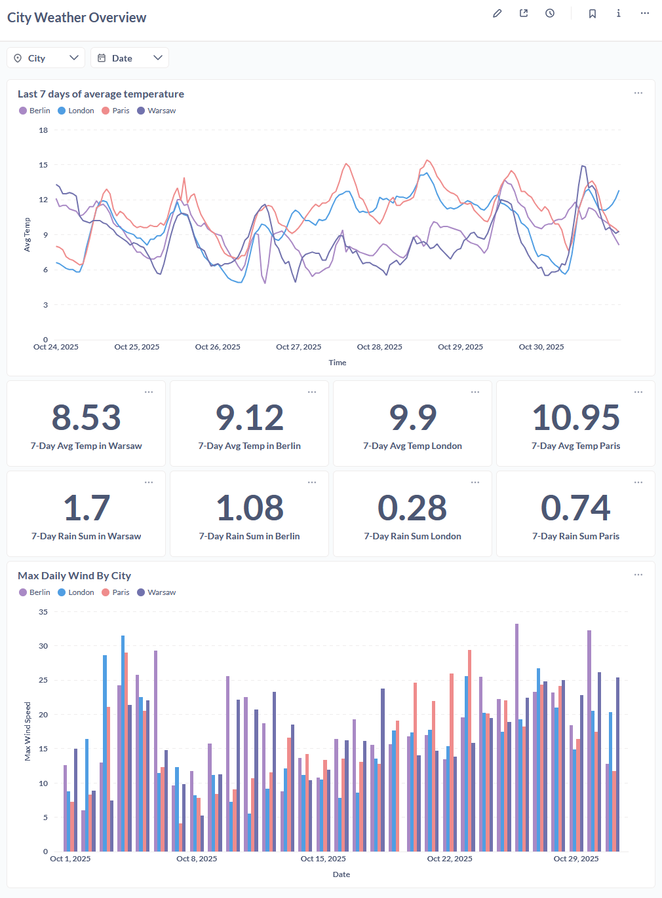

Production-Ready ETL Pipeline

# OpenMeteo Weather ETL

End-to-end data engineering pipeline demonstrating modern ELT patterns, automated quality checks, and real-time orchestration. Built with industry-standard tools on a completely free tech stack.

[View on GitHub :fontawesome-brands-github:](https://github.com/a-chmielewski/endtoend-etl-openmeteo){ .custom-btn }
[See Dashboard :fontawesome-solid-chart-line:](#live-dashboard){ .custom-btn .custom-btn-secondary }

---

## :rocket: Project Highlights

:material-pipeline:

### **Production-Grade ELT**
Implements Extract-Load-Transform pattern with raw data lake, staging layer, and analytical marts following dimensional modeling best practices.

:material-check-decagram:

### **Automated Quality Gates**
Great Expectations validates every batch before loading, preventing bad data from corrupting the warehouse with schema and range checks.

:material-refresh-auto:

### **Incremental Processing**
Watermark-based ingestion fetches only new data, optimizing API usage and processing time while maintaining data freshness.

:material-calendar-clock:

### **Airflow Orchestration**
DAG-based workflow runs hourly, handling retries, dependencies, and monitoring. Fully containerized for reproducible deployments.

:material-graph:

### **dbt Transformations**
SQL-based transformations with built-in testing, documentation, and lineage tracking. Separates business logic from infrastructure.

:material-chart-box:

### **BI-Ready Outputs**
Metabase dashboards provide self-service analytics with filters and drill-downs. Daily aggregations optimized for query performance.

---

## :bar_chart: Live Dashboard

**Interactive Metabase dashboard featuring:**

- Multi-city temperature comparison with time-series visualization
- Daily aggregations (min, max, avg temperature)
- Date range filters for custom analysis
- Responsive design for mobile and desktop

[View Full Dashboard Details →](dashboard.md){ .custom-btn }

---

## :building_construction: Architecture

The pipeline follows a modern medallion architecture with separation of concerns:

```mermaid
flowchart TB
    subgraph API["Data Source"]
        A[Open-Meteo API<br/>Weather Data]
    end
    
    subgraph Storage["Raw Data Lake"]
        B[MinIO S3<br/>Partitioned by Date/Hour]
    end
    
    subgraph Quality["Quality Gate"]
        F[Great Expectations<br/>Schema & Range Validation]
    end
    
    subgraph Database["Data Warehouse"]
        C[PostgreSQL Staging<br/>staging.weather_hourly]
        D[dbt Marts<br/>fct_city_day]
    end
    
    subgraph BI["Analytics Layer"]
        E[Metabase Dashboards<br/>Self-Service BI]
    end
    
    subgraph Orchestration["Workflow Management"]
        G[Apache Airflow<br/>Hourly Scheduling]
    end
    
    A -->|Extract| B
    B -->|Validate| F
    F -->|Pass| C
    C -->|Transform| D
    D -->|Visualize| E
    G -.->|Orchestrates| A
    G -.->|Orchestrates| B
    G -.->|Orchestrates| F
    G -.->|Orchestrates| C
    G -.->|Orchestrates| D
    
    style A fill:#1e2542,stroke:#00d4ff
    style B fill:#1e2542,stroke:#00d4ff
    style C fill:#1e2542,stroke:#00d4ff
    style D fill:#1e2542,stroke:#00d4ff
    style E fill:#1e2542,stroke:#00d4ff
    style F fill:#1e2542,stroke:#00d4ff
    style G fill:#1e2542,stroke:#00d4ff
```

**Key Design Decisions:**

- **Raw Data Persistence**: All source data stored in MinIO for reprocessability and audit trails
- **Quality-First**: Validation happens before database insertion, maintaining data integrity
- **Idempotent Operations**: Upsert logic allows safe pipeline reruns without data duplication
- **Incremental Processing**: Only fetches data after last successful load timestamp

[Detailed Architecture Documentation →](architecture.md){ .custom-btn }

---

## :hammer_and_wrench: Tech Stack

**Python 3.9+**  
Core Language

**PostgreSQL 16**  
OLAP Database

**Apache Airflow 2.9+**  
Orchestration

**dbt Core 1.7+**  
Transformations

**Great Expectations**  
Data Quality

**MinIO**  
S3-Compatible Storage

**Metabase**  
BI & Dashboards

**Docker Compose**  
Infrastructure

!!! success "100% Free & Open Source"
    This entire stack runs on free, open-source tools. No cloud costs, no licensing fees. Perfect for learning, prototyping, and showcasing data engineering skills.

---

## :chart_with_upwards_trend: Key Metrics

5+
Technologies Integrated

24/7
Hourly Updates

100%
Data Quality Checks

4
European Cities

---

## :books: Documentation

### [:fontawesome-solid-database: Data Model](data_model.md)
Explore the schema design, dimensional models, and table relationships in the data warehouse.

### [:fontawesome-solid-check-circle: Data Quality](data_qulaity.md)
Learn about validation rules, expectations, and how bad data is prevented from entering the pipeline.

### [:fontawesome-solid-terminal: How to Run](how_to_run.md)
Step-by-step guide to deploy the pipeline locally with Docker, including troubleshooting tips.

### [:fontawesome-solid-project-diagram: dbt Lineage](dbt/index.html)
Interactive data lineage graph showing how raw data flows through transformations to final marts.

---

## :trophy: What Makes This Project Stand Out

!!! example "Industry Best Practices"
    - **Version Control**: All code, SQL, and configurations in Git
    - **Testing**: dbt tests validate data transformations automatically
    - **Documentation**: Self-documenting dbt models with descriptions
    - **CI/CD Ready**: Structured for deployment to production environments
    - **Monitoring**: Airflow tracks task success/failure with alerting capability
    - **Scalability**: Partition-based storage supports growing data volumes

!!! tip "Perfect for Data Engineering Portfolios"
    This project demonstrates comprehensive understanding of:
    
    - Building production-ready pipelines from scratch
    - Integrating multiple data engineering tools
    - Implementing data quality frameworks
    - Following dimensional modeling principles
    - Creating self-service analytics platforms
    - Containerizing data infrastructure

---

## :rocket: Quick Start

Ready to run it yourself?

[How to Run Locally →](how_to_run.md){ .custom-btn }
[View Source Code →](https://github.com/a-chmielewski/endtoend-etl-openmeteo){ .custom-btn .custom-btn-secondary }

---

Built with :material-heart: by <a href="https://github.com/a-chmielewski" style="color: #00d4ff;">Aleksander Chmielewski</a>

